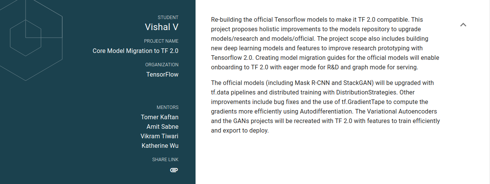

  
## Google Summer of Code 2019: **Final Work Product**
---
### **Organisation**: Tensorflow
### **Mentors**
- Tomer Kaftan ([@tomerk](https://github.com/tomerk))
- Amit Sabne ([@amitsabne1](https://github.com/amitsabne1))
- Vikram Tiwari ([@VikramTiwari](https://github.com/VikramTiwari))
- Katherine Wu ([@k-w-w](https://github.com/k-w-w))
- Paige Bailey ([@dynamicwebpaige](https://github.com/dynamicwebpaige))
### **Summary**

  
### Tasks
|Evaluation|Task|Link|Status|Pull Request|
|---|---|---|---|---|
|E1|Autoencoder Migration |[Here](https://github.com/Vishal-V/GSoC/tree/master/autoencoder)| Complete |[ #68](https://github.com/tensorflow/examples/pull/68)
|E1|Boosted Trees Migration|[Here](https://github.com/Vishal-V/GSoC/tree/master/boosted_trees)|  WIP - Minor Bug Fixes |[Branch](https://github.com/Vishal-V/examples-1/tree/boosted-tree-migration)|
|E1|Hyperparameter Search|[Here](https://github.com/Vishal-V/GSoC/blob/master/keras_tuner/hyperparamter_search.ipynb)| Keras Tuner not yet in Tf 2.0 |[Branch](https://github.com/Vishal-V/examples-1/tree/hyperparam-optimization)|
|E1|Custom ResNet with TinyImageNet - Part 1 |[Here](https://github.com/Vishal-V/GSoC/blob/master/tiny_imagenet_custom_resnet/tiny_imagenet_custom_resnet.ipynb)|Model Demo Complete |[ #79](https://github.com/tensorflow/examples/pull/79)|
|E2|StackGAN Model|[Here](https://github.com/Vishal-V/GSoC/tree/master/stack_gan)| Complete |[ #77](https://github.com/tensorflow/examples/pull/77)
|E2|Mask R-CNN Migration|[Here](https://github.com/Vishal-V/GSoC/tree/master/mask_rcnn)|Migration Complete|[ #78](https://github.com/tensorflow/examples/pull/78)|
|E2|Custom ResNet with TinyImageNet - Part 2 |[Here](https://github.com/Vishal-V/GSoC/blob/master/tiny_imagenet_custom_resnet/tiny_imagenet_custom_resnet.ipynb)|Occlusion and Progressive Resizing Complete|[ #79](https://github.com/tensorflow/examples/pull/79)|
|E3|Mask R-CNN - TF 2.0 Model |[Here](https://github.com/Vishal-V/GSoC/tree/master/mask_rcnn)|Ongoing|[ #78](https://github.com/tensorflow/examples/pull/78)|
|E3|Custom ResNet with TinyImageNet - Notebook |[Here](https://github.com/Vishal-V/GSoC/blob/master/tiny_imagenet_custom_resnet/tiny_imagenet_custom_resnet.ipynb)|Complete|[ #79](https://github.com/tensorflow/examples/pull/79)|
|E3|StackGAN - Notebook |[Here](https://github.com/Vishal-V/GSoC/blob/master/tiny_imagenet_custom_resnet/tiny_imagenet_custom_resnet.ipynb)|Ongoing|[ #77](https://github.com/tensorflow/examples/pull/77)|
#
### **Work Done**
1. [Autoencoder - Migration](https://github.com/Vishal-V/GSoC/blob/master/autoencoder/README.md)
2. [Autoencoder - Model](https://github.com/Vishal-V/GSoC/tree/master/autoencoder/model)
3. [Custom ResNet for TinyImageNet - Model](https://github.com/Vishal-V/GSoC/tree/master/tiny_imagenet_custom_resnet/model)
4. [Custom ResNet for TinyImageNet - Notebook](https://github.com/Vishal-V/GSoC/blob/master/tiny_imagenet_custom_resnet/tiny_imagenet_custom_resnet.ipynb)
5. [Mask R-CNN - Migration](https://github.com/Vishal-V/GSoC/blob/master/mask_rcnn/README.md)
6. [Mask R-CNN - Notebook](https://github.com/Vishal-V/GSoC/tree/master/mask_rcnn/notebooks)
7. [Mask R-CNN - Model](https://github.com/Vishal-V/GSoC/tree/master/mask_rcnn)
8. [StackGAN - Model](https://github.com/Vishal-V/GSoC/tree/master/stack_gan)
9. [StackGAN - Notebook](https://github.com/Vishal-V/GSoC/blob/master/stack_gan/notebook/stack_gan.ipynb)
10. [Hyperparameter Search](https://github.com/Vishal-V/GSoC/blob/master/keras_tuner/hyperparamter_search.ipynb)
### **Improvements**
